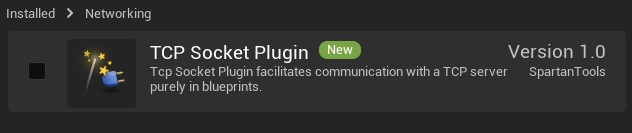
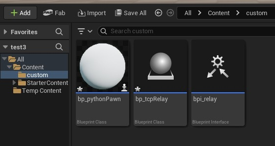
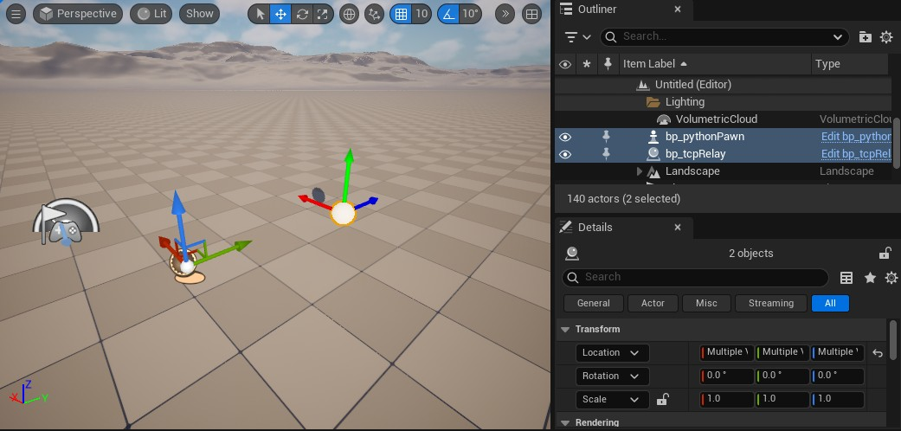
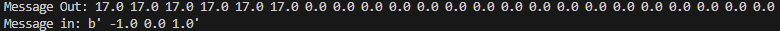
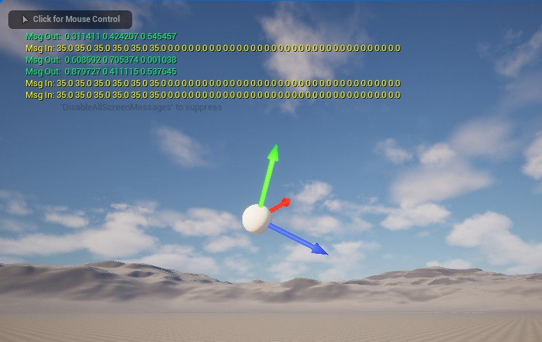

# Realtime Python Pawn Control in Unreal Engine 5 with TCP

This project provides a simple way with native python libraries to exchange real-time data from a python script to an Unreal Engine 5 runtime

This can be used to control UE5 actors, characters, and environments with simple data from Python
- Example: using ArduPilot SITL to control the location and orientation of an actor in UE5

...and to receive feedback from interactions with the UE5 environment:
- Example: Add context to the SITL world by simulating a lidar height sensor
<br>

## Files:
`bp_tcpRelay_no_bpi.uasset`<br>
Blueprint that uses the SpartanCode TCP Socket Plugin parent class to convert bytes from Python to an array of floats
- Full blueprint image: [bp_tcpRelay - Graph](media/bp_tcpRelay_overall.png)<br>
<br>

`bpi_relay.uasset`<br>
 Basic blueprint interface to exchange data between the tcp_relay and other UE actors

 ### Quick How-To
 1. Start a new UE project and enable the SpartanCode TCP Socket Plugin
 2. Add the `bp_tcpRelay`, `bpi_relay`, and `bp_pythoPawn` to your project
 3. In your `bp_tcpRelay` actor, use the `Get Actor of Class` to identify the `pythonPawn` as the `send_to` actor
 4. Conversely, in your `bp_pythonPawn`, use the `Get Actor of Class` node to indetify the `bp_tcpRelay` actor
 5. Place your `tcpRelay` actor in the level
 6. Place the `pythonPawn` actor in the level, or, make it your player pawn (you might need to create a new blank GameMode to change default player pawn)
 7. Launch `tcp_relay.py` as a main python script and it will start sending values to UE5
 8. The `pythonPawn` should begin moving and rotating based on the python script
 9. The python script will recieve bytes containing the three floats generated in realtime from the `pythonPawn` (you can parse with .split() and convert to floats) 


## Setup from new Unreal Engine 5 - Blank Game with Blueprints

### Download SpartanCode TCP Socket Plugin
 - Fab Page: https://www.fab.com/listings/48db4522-8a05-4b91-bcf8-4217a698339b
 - Github: https://github.com/CodeSpartan/UE4TcpSocketPlugin

<br>

 If you download from Fab, it will be in your Epic Games Launcher, Unreal Engine Libray:


Then install to engine.

### Create a new UE5 Game with Blank Template
Enable blueprints.

### Launch Editor and Activate Plugin
1. Click Settings drop-down in the top-right of your editor window
2. Click Plugins
3. Search for 'tcp' and it should appear at the top of the list



Enable plugin the and a window will pop-up up prompting you to restart UE Editor, click **Restart Now**

### Set up TCP Relay Actor using TCP Socket Plugin
We'll import the invisible TCP Relay actor that we can drag into the level

### Download Blueprints
```
bp_tcpRelay.uassest
bp_pythonPawn.uasset
bpi_relay.uasset
```
Create a `custom` folder in the `content` folder in the Content Drawer. In Explorer,place these blueprints in you Unreal Project/content folder

> For example on windows in the default Unreal Engine save path it looks like: <br>
 C:\Users\<username>\Documents\Unreal Projects\myTcpRelayProject\Content\custom

Back in Unreal Editor, they should appear in your content drawer:



### Drag bp_tcpRelay actor and bp_pythonPawn pawn into the level

> If you're not seeing data, make sure you remembered to place the tcpRelay actor in your level

> If you want to use the bp_pythonPawn as the default player pawn instead, you'll probably have create a new blankGame mode



## Look for data exchange between Python and UE5
Run `tcp_relay.py` as main python script to create the relay sever.

> The code has notional variables for x, y, z, pitch, roll, yaw, which will increase by 1 every second and stream to the TCP Relay actor

With your TCP relay actor placed in the UE level, start the Play in Editor to launch the game runtime

- The UE Editor will print the data its receiving in yellow and sending in green<br>
- Floats_out from UE is default `'0.0 0.0 0.0'` but you can change the floats_out items if you want see it change in Python


<br>
- The Python code will print the data it's sending out and data its receiving (23 fields out, 3 in by default)<br><br>



### Controlling a basic UE5 Actor or Pawn
The example pawn has the following variables:
```
Premade:
    data_live: bool
    location: vector
    rotation: rotator
    floats_out = float_array (default 3 items)

Promoted from nodes to avoid conflicts:
    relay_actor: bp_tcpRelay actor (inherits class)
    floats_in: float_array (inherits size)
```
The example pawn recieves the x, y, z, roll, pitch, yaw in the first six items we send from python to UE.

```
floats_in[:3] --> location vector
floats_in[:6] --> rotation rotator
```

Then we use an `Actor Set Location and Rotation` node using the location vector and rotation rotator

Start play-in-editor runtime. The pawn should begin moving and rotating based on the python values


Here's an overview of the entire process:
```
Python:
    inits a TCP_Relay object
    creates msg_out string: "{x} {y} {z} {pitch} {roll} {yaw} ... "
    TCP Relay server sends bytes(msg_out) to client

UE5/tcpRelay:
    receives bytes(msg_in), parses to string and splits into list
    converts list of strings to floats and creates `floats_in` array
    relays floats_in array to pythonPawn through bpi_relay interface

UE5/pythonPawn:
    recieves floats_in array from tcp_relay via bpi_relay interface
    parses floats_in arrays by index to assign values to vectors, rotators, or bools with == nodes
    gets data from environment, such as 1.0 for a collision event or a distance using a line trace, to create floats_out array
    sends floats_out array to tcpRelay via bpi_relay

UE5/tcpRelay: 
    recieves floats_out from pythonPawn, encodes to bytes, returns to Python

Python
    recieves floats from tcp_relay as msg_in
    parses msg_in to floats and uses data in main loop

repeats
```

