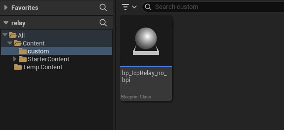
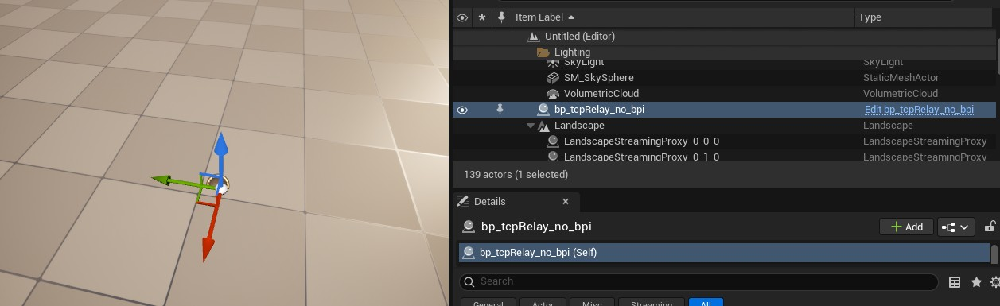

Hello

This project provides a simple way to exchange real-time data from a python script to an Unreal Engine 5 runtime

This can be used to control UE5 actors, characters, and environments with simple data from Python
    - Example: using ArduPilot SITL to control the location and orientation of an actor in UE5

...and to receive feedback from interactions with the UE5 environment
    - Example: Add context to the SITL world by simulating a lidar height sensor

## Setup from new Unreal Engine 5 - Blank Game with Blueprints

### Download SpartanCode TCP Socket Plugin
 - Fab Page: https://www.fab.com/listings/48db4522-8a05-4b91-bcf8-4217a698339b
 - Github: https://github.com/CodeSpartan/UE4TcpSocketPlugin

 

 If you download from Fab, it will be in your Epic Games Launcher, Unreal Engine Libray:

Then install to engine.

### Create a new UE5 Game with Blank Template
Enable blueprints.

### Launch Editor and Activate Plugin
1. Click Settings drop-down in the top-right of your editor window
2. Click Plugins
3. Search for 'tcp' and it should appear at the top of the list

Enable plugin the and a window will pop-up up prompting you to restart UE Editor, click **Restart Now**

### Set up TCP Relay Actor using TCP Socket Plugin
We'll import the invisible TCP Relay actor that we can drag into the level

### Download Blueprints

From repo: `bp_tcpRelay_no_bpi.uassest`

Does not include a blueprint interface for cleaner import

Place this in your Unreal Project folder in Explorer, for example on windows in the default Unreal Engine save path, ie:  

`C:\Users\__user__\Documents\Unreal Projects\myTcpRelayProject\Content\custom`

For example, in explorer:

### Drag into Level
The `bp_tcpRelay_no_bpi.uassest` will show up in your content/custom folder in the Content Drawer

**Now just drag and drop into the level**

> If you're not seeing data - make sure you remembered to place this in the level