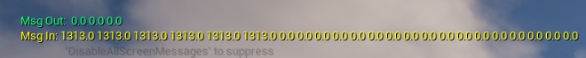

# Realtime Python Pawn Control in Unreal Engine 5 with TCP

This project provides a simple way with native python libraries to exchange real-time data from a python script to an Unreal Engine 5 runtime

This can be used to control UE5 actors, characters, and environments with simple data from Python
- Example: using ArduPilot SITL to control the location and orientation of an actor in UE5

...and to receive feedback from interactions with the UE5 environment:
- Example: Add context to the SITL world by simulating a lidar height sensor
<br>

## Files:
`bp_tcpRelay_no_bpi.uasset`<br>
Blueprint that uses the SpartanCode TCP Socket Plugin parent class to convert bytes from Python to an array of floats
- Full blueprint image: [bp_tcpRelay - Graph](media/bp_tcpRelay_overall.jpg)<br>
- Top: [bp_tcpRelay - Graph Top](media\bp_tcpRelay_noBpi_graph_top.jpg)
- Bottom: [bp_tcpRelay - Graph Bottom](media\bp_tcpRelay_noBpi_graph_bottom.jpg)
<br>

`bpi_relay.uasset`<br>
 Basic blueprint interface to exchange data between the tcp_relay and other UE actors


## Setup from new Unreal Engine 5 - Blank Game with Blueprints

### Download SpartanCode TCP Socket Plugin
 - Fab Page: https://www.fab.com/listings/48db4522-8a05-4b91-bcf8-4217a698339b
 - Github: https://github.com/CodeSpartan/UE4TcpSocketPlugin

<br>

 If you download from Fab, it will be in your Epic Games Launcher, Unreal Engine Libray:


Then install to engine.

### Create a new UE5 Game with Blank Template
Enable blueprints.

### Launch Editor and Activate Plugin
1. Click Settings drop-down in the top-right of your editor window
2. Click Plugins
3. Search for 'tcp' and it should appear at the top of the list


Enable plugin the and a window will pop-up up prompting you to restart UE Editor, click **Restart Now**

### Set up TCP Relay Actor using TCP Socket Plugin
We'll import the invisible TCP Relay actor that we can drag into the level

### Download Blueprints

From repo: `bp_tcpRelay_no_bpi.uassest`

Does not include a blueprint interface nodes in the blueprint for cleaner import

Place this in your Unreal Project folder in Explorer, for example on windows in the default Unreal Engine save path, ie: <br>

`C:\Users\__user__\Documents\Unreal Projects\myTcpRelayProject\Content\custom`

For example, in explorer:


### Drag into Level
The `bp_tcpRelay_no_bpi.uassest` will show up in your content/custom folder in the Content Drawer


**Now just drag and drop into the level**


> If you're not seeing data - make sure you remembered to place actor in the new level

## Look for data moving between Python and UE5
Run `tcp_relay.py` as main python script to create the relay sever.

> The code has notional variables for x, y, z, pitch, roll, yaw, which will increase by 1 every second and stream to the TCP Relay actor

With your TCP relay actor placed in the UE level, start the Play in Editor to launch the game runtime

- The UE Editor will print the data its receiving in yellow and sending in green<br>
- Floats_out from UE is default `'0.0 0.0 0.0'` but you can change the floats_out items if you want see it change in Python



<br>
- The Python code will print the data it's sending out and data its receiving (23 fields out, 3 in by default)<br><br>


### Creating a Blueprint Interface to Communicate with Actors
1. Download `bpi_relay.uasset`

    OR

2. Create new blueprint inferface
    - Create a new blueprint interface object: `bpi_relay`
    - in blueprint interface editor, create function `relay_float_array`
    - Create a `floats` array as an input
    

### Add Blueprint Interface to TCP Relay Blueprint
#### Add blueprint interface message to communicate with target actor
 - In the TCP Relay blueprint editor, open the Class Settings and add the "bpi_relay" interface from the "Implemented Interfaces - Add" dropdown

 - Create a Relay Float Array (Message) node that executes after we convert our `msg_in` string our to `floats_in` array, plug in our `Send_To` actor as the target and our `Floats_in` array as the data to send

    

#### Implement bpi_relay function as a custom event in the TCP Relay actor
Implement this event to recieve data back from the `send_to` actor
    


### Controlling a basic UE5 Actor or Pawn
We'll use the notional x, y, z, roll, pitch, yaw values we're sending in the example code to set the transform of a pawn in UE5.

 > You can use this pawn as your player character or change the default mode to Spectator Camera and look for the moving pawn to confirm its working

> You may need to create a new blank GameMode to select the pawn as your default player pawn class, or swap to FunctionalTest mode to use spectactor camera as player pawn

#### Download sample pawn


1. Create a new Pawn blueprint

    > You can also just use the Actor class if you don't need the controlled actor to be a player

2. Create variables:
    ```
    data_live: bool
    location: vector
    rotation: rotator
    floats_out = float_array (default 3 items)
    ```
    
    We'll also create variables `relay_actor` and `floats_in` by promoting output nodes to variables 

2. In event graph, identify Tcp Relay actor to communicate with:

    `Event Begin Play: --> Get Actor of Class --> Promote Actor to new variable: relay_actor`
    - Use the Get Actor of Class node to select the class of the tcp_relay actor (*if you're using the one in this repo, it'd be `bp_tcpRelay_no_bpi`*)
    - This is now the `relay_actor` variable

3. In Class Settings, add the blueprint interface (*ie `bpi_relay`*) to your Implemented Interfaces. Then, implement the event in your Event Graph.

4. Implement the `relay_float_array` as a custom event, connect to the branch using the `live_data` bool (prevents attempts to parse until next tick) and promote output to `floats_in`

5. Create a new transform variable `transform`

Iterate through the floats_in array and assign the values to the transform object

    ```
    x = floats_in[0]`
    y = floats_in[1]`
    z = floats_in[2]`
    roll = floats_in[3]`
    pitch = floats_in[4]`
    yaw = floats_in[5]`
    ```


